# Build a Dashboard Application with Plotly Dash
In this lab, you will be building a Plotly Dash application for users to perform interactive visual analytics on SpaceX launch data in
real-time.

This dashboard application contains input components such as a dropdown list and a range slider to
interact with a pie chart and a scatter point chart. You will be guided to build this dashboard application via the following tasks:

- TASK 1: Add a Launch Site Drop-down Input Component
- TASK 2: Add a callback function to render success-pie-chart based on selected site dropdown
- TASK 3: Add a Range Slider to Select Payload
- TASK 4: Add a callback function to render the success-payload-scatter-chart scatter plot

***Note:Please take screenshots of the Dashboard and save them. Further upload your notebook to github.***

***The github url and the screenshots are later required in the presentation slides.***

Your completed dashboard application should look like the following screenshot:
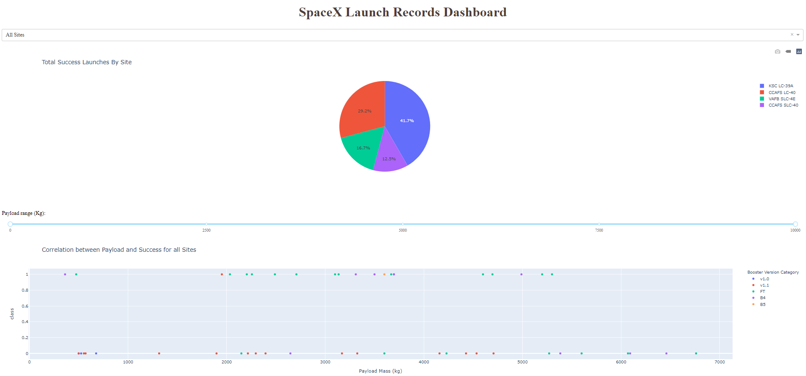

After visual analysis using the dashboard, you should be able to obtain some insights to answer the following five questions:

1. Which site has the largest successful launches?
2. Which site has the highest launch success rate?
3. Which payload range(s) has the highest launch success rate?
4. Which payload range(s) has the lowest launch success rate?
5. Which F9 Booster version (v1.0, v1.1, FT, B4, B5, etc.) has the highest
launch success rate?

Estimated time needed: 90 minutes

## Setup development environment
### Install required Python packages
- Open a new terminal, by clicking on the menu bar and selecting Terminal->New Terminal, as in the image below.
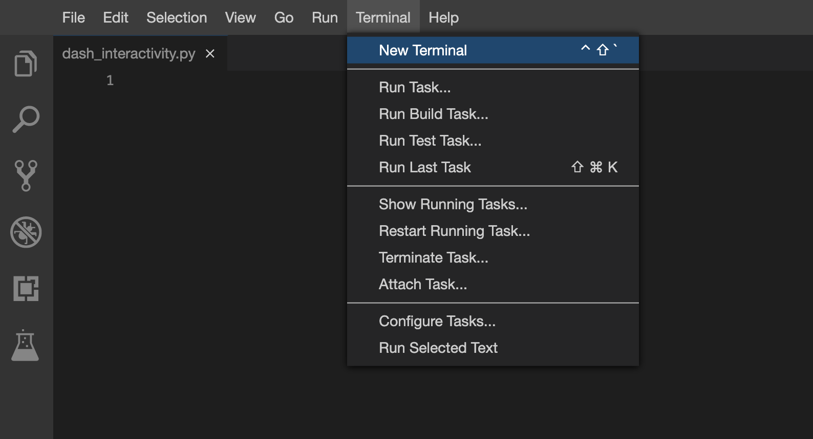

- Now, you have script and terminal ready to start the lab.
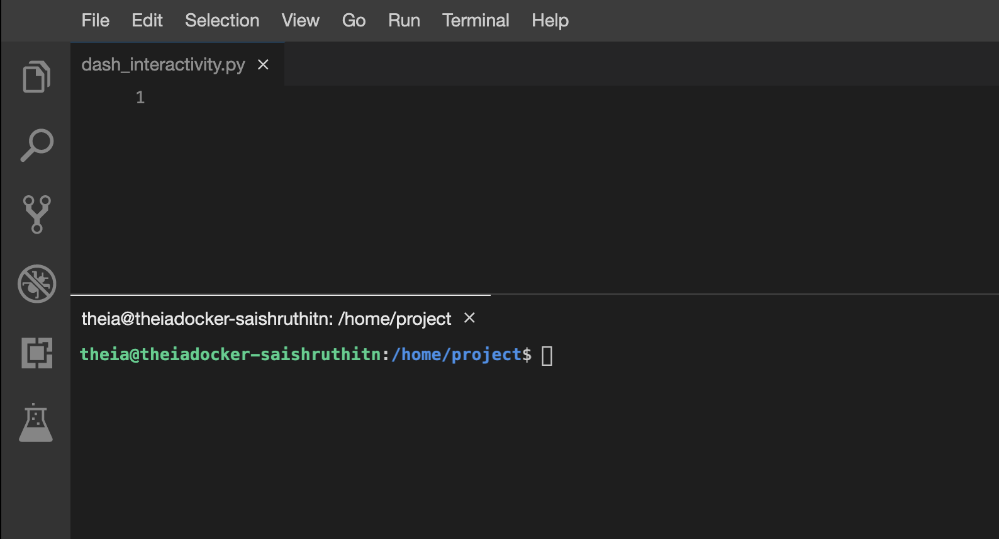

Install python packages required to run the application.
Copy and paste the below command to the terminal.

    1 python3.11 -m pip install pandas dash

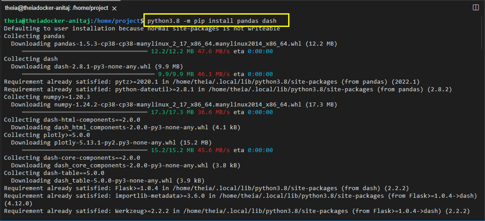

### Download a skeleton dashboard application and dataset
First, let’s get the SpaceX Launch dataset for this lab:

- Run the following `wget` command line in the terminal to download dataset as `spacex_launch_dash.csv`

        1 wget "https://cf-courses-data.s3.us.cloud-object-storage.appdomain.cloud/IBM-DS0321EN-SkillsNetwork/datasets/spacex_launch_dash.csv"

- Download a skeleton Dash app to be completed in this lab:

        1 wget "https://cf-courses-data.s3.us.cloud-object-storage.appdomain.cloud/IBM-DS0321EN-SkillsNetwork/labs/module_3/spacex_dash_app.py"

- Test the skeleton app by running the following command in the terminal:

        1 python3.11 spacex_dash_app.py

- Observe the port number (8050) shown in the terminal.
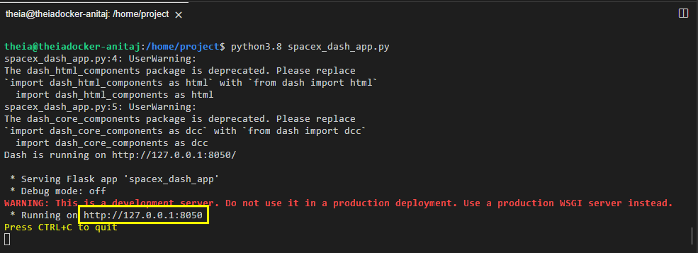

In the left Navigation Pane click on `Others` and click `Launch Application` option under it.Enter the application port number as 8050.

Click `Your Application`.
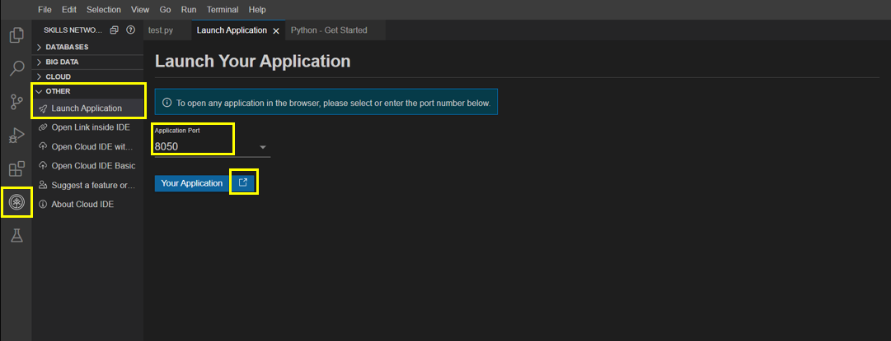

- You should see a nearly blank web page indicating a successfully running dash app.
Next, let’s fill the skeleton app with required input/output components and callback functions.

If you need to refresh your memory about Plotly Dash components and callback functions,
you may refer to the lab you have learned before:
[Plotly Dash Lab](https://cf-courses-data.s3.us.cloud-object-storage.appdomain.cloud/IBMDeveloperSkillsNetwork-DV0101EN-SkillsNetwork/labs/Module%204/4.7_Dash_Interactivity.py)

### TASK 1: Add a Launch Site Drop-down Input Component
We have four different launch sites and we would like to first see which one has the largest success count. Then,
we would like to select one specific site and check its detailed success rate (class=0 vs. class=1).

As such, we will need a dropdown menu to let us select different launch sites.

- Find and complete a commented `dcc.Dropdown(id='site-dropdown',...)` input with following attributes:
 - `id` attribute with value `site-dropdown`
 - `options` attribute is a list of dict-like option objects (with `label` and `value` attributes). You can set
the `label` and `value` all to be the launch site names in the `spacex_df`
and you need to include the default All option. e.g.,

        1 options=[{'label': 'All Sites', 'value': 'ALL'},{'label': 'site1', 'value': 'site1'}, ...]

 - `value` attribute with default dropdown value to be `ALL` meaning all sites are selected
 - `placeholder` attribute to show a text description about this input area,
such as `Select a Launch Site here`
`searchable` attribute to be True so we can enter keywords to search launch sites\

Here is an example of dcc.Dropdown:

    dcc.Dropdown(id='id',
                options=[
                    {'label': 'All Sites', 'value': 'ALL'},
                    {'label': 'site1', 'value': 'site1'},
                ],
                value='ALL',
                placeholder="place holder here",
                searchable=True
                ),

If you need more help about `Dropdown()`, refer to the `Plotly Dash Reference` section towards
the end of this lab.

Your completed dropdown menu should look like the following screenshot:
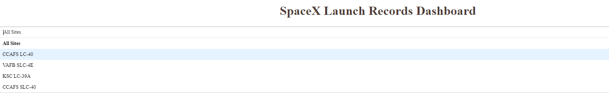

### TASK 2: Add a callback function to render `success-pie-chart` based on selected site dropdown
The general idea of this callback function is to get the selected launch site from `site-dropdown` and render
a pie chart visualizing launch success counts.

Dash callback function is a type of Python function which will be automatically called by
Dash whenever receiving an input component updates, such as a click or dropdown selecting event.

If you need to refresh your memory about Plotly Dash callback functions,
you may refer to the lab you have learned before:

[Plotly Dash Lab](https://cf-courses-data.s3.us.cloud-object-storage.appdomain.cloud/IBMDeveloperSkillsNetwork-DV0101EN-SkillsNetwork/labs/Module%204/4.7_Dash_Interactivity.py)

Let’s add a callback function in `spacex_dash_app.py` including the following application logic:

- Input is set to be the `site-dropdown` dropdown, i.e., `Input(component_id='site-dropdown', component_property='value')`
- Output to be the graph with id `success-pie-chart`, i.e., `Output(component_id='success-pie-chart', component_property='figure')`
- A `If-Else` statement to check if ALL sites were selected or just a specific launch site was selected
 - If ALL sites are selected, we will use all rows in the dataframe `spacex_df` to render and return a pie chart graph to show the total success launches (i.e., the total count of `class` column)
 - If a specific launch site is selected, you need to filter the dataframe `spacex_df` first in order to include the only data for the selected site.\
 Then, render and return a pie chart graph to show the success (`class=1`) count and failed (`class=0`) count for the selected site.

Here is an example of a callback function:

    # Function decorator to specify function input and output
    @app.callback(Output(component_id='success-pie-chart', component_property='figure'),
                Input(component_id='site-dropdown', component_property='value'))
    def get_pie_chart(entered_site):
        filtered_df = spacex_df
        if entered_site == 'ALL':
            fig = px.pie(data, values='class', 
            names='pie chart names', 
            title='title')
            return fig
        else:
            # return the outcomes piechart for a selected site

The rendered pie chart should look like the following screenshots:

- Pie chart for all sites are selected
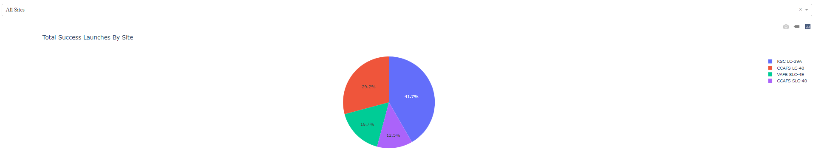

- Pie chart for is selected
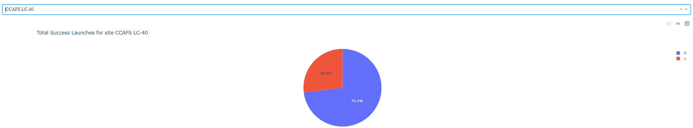

If you need more reference about dash callbacks and plotly pie charts, refer to the `Plotly Dash Reference` section towards the end of this lab.

### TASK 3: Add a Range Slider to Select Payload
Next, we want to find if variable payload is correlated to mission outcome. From a dashboard point of view, we
want to be able to easily select different payload range and see if we can identify some visual patterns.

Find and complete a commented `dcc.RangeSlider(id='payload-slider',...)` input with the following attribute:

- `id` to be `payload-slider`
- `min` indicating the slider starting point, we set its value to be 0 (Kg)
- `max` indicating the slider ending point to, we set its value to be 10000 (Kg)
- `step` indicating the slider interval on the slider, we set its value to be 1000 (Kg)
- `value` indicating the current selected range, we could set it to be `min_payload` and `max_payload`

Here is an example of RangeSlider:

    dcc.RangeSlider(id='id',
                    min=0, max=10000, step=1000,
                    marks={0: '0',
                        100: '100'},
                    value=[min_value, max_value])

You completed payload range slider should be similar the following screenshot:
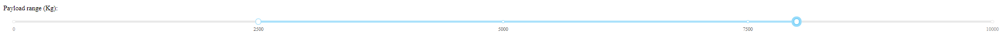

If you need more reference about range slider, refer to the `Plotly Dash Reference` towards
the end of this lab.

### TASK 4: Add a callback function to render the `success-payload-scatter-chart` scatter plot
Next, we want to plot a scatter plot with the x axis to be the payload and the y axis to be the launch outcome (i.e., `class` column).
As such, we can visually observe how payload may be correlated with mission outcomes for selected site(s).

In addition, we want to color-label the Booster version on each scatter point so that we may
observe mission outcomes with different boosters.

Now, let’s add a call function including the following application logic:

- Input to be `[Input(component_id='site-dropdown', component_property='value'), Input(component_id="payload-slider", component_property="value")]`\
Note that we have two input components, one to receive selected launch site and another to receive selected payload range
- Output to be `Output(component_id='success-payload-scatter-chart', component_property='figure')`
- A `If-Else` statement to check if ALL sites were selected or just a specific launch site was selected
 - If ALL sites are selected, render a scatter plot to display all values for variable `Payload Mass (kg)` and variable `class`.
 - In addition, the point color needs to be set to the booster version i.e., `color="Booster Version Category"`
If a specific launch site is selected, you need to filter the `spacex_df` first, and render a scatter chart to show
values `Payload Mass (kg)` and `class` for the selected site, and color-label the point using `Boosster Version Category` likewise.
You rendered scatter point should look like the following screenshot:
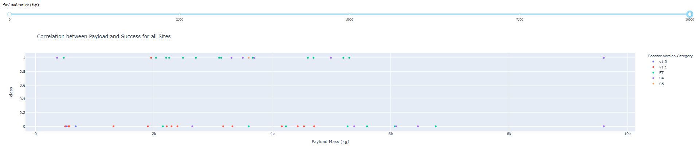

If you need more reference about dash callbacks and plotly scatter plots, refer to the `Plotly Dash Reference` towards
the end of this lab.

### Finding Insights Visually
Now with the dashboard completed, you should be able to use it to analyze SpaceX launch data, and answer the following questions:

1. Which site has the largest successful launches?
2. Which site has the highest launch success rate?
3. Which payload range(s) has the highest launch success rate?
4. Which payload range(s) has the lowest launch success rate?
5. Which F9 Booster version (v1.0, v1.1, FT, B4, B5, etc.) has the highest
launch success rate?

### Plotly Dash Reference
#### Dropdown (input) component
Refer [here](https://dash.plotly.com/dash-core-components/dropdown) for more details about `dcc.Dropdown()`

#### Range slider (input) component
Refer [here](https://dash.plotly.com/dash-core-components/rangeslider) for more details about `dcc.RangeSlider()`

#### Pie chart (output) component
Refer [here](https://plotly.com/python/pie-charts/) for more details about plotly pie charts

#### Scatter chart (output) component
Refer [here](https://plotly.com/python/line-and-scatter/) for more details about plotly scatter charts
