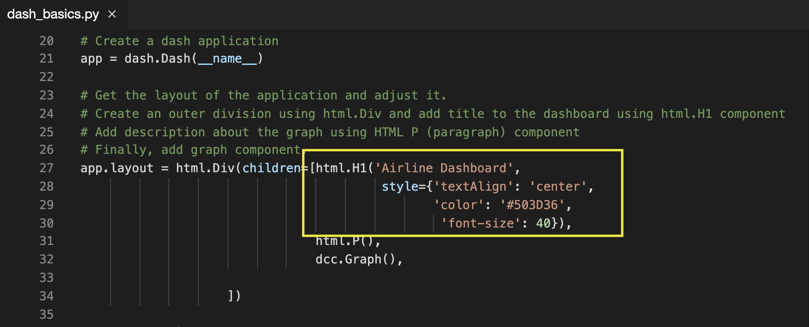

# Dash Basics: HTML and Core Components

### Dataset Used
[Airline Reporting Carrier On-Time Performance](https://developer.ibm.com/exchanges/data/all/airline?cm_mmc=Email_Newsletter-_-Developer_Ed%2BTech-_-WW_WW-_-SkillsNetwork-Courses-IBMDeveloperSkillsNetwork-DV0101EN-SkillsNetwork-20297740&cm_mmca1=000026UJ&cm_mmca2=10006555&cm_mmca3=M12345678&cvosrc=email.Newsletter.M12345678&cvo_campaign=000026UJ) dataset from Data Asset eXchange

## Let's start creating dash application
### Goal
Create a dashboard that displays the percentage of flights running under specific distance group. Distance group is the distance intervals, every 250 miles, for flight segment. If the flight covers to 500 miles, it will be under distance group 2 (250 miles + 250 miles).
### Expected Output
Below is the expected result from the lab. Our dashboard application consists of three components:
- Title of the application
- Description of the application
- Chart conveying the proportion of distance group by month

### To do:
1. Import required libraries and read the dataset
2. Create an application layout
3. Add title to the dashboard using HTML H1 component
4. Add a paragraph about the chart using HTML P component
5. Add the pie chart above using core graph component
6. Run the app

## Get the tool ready
- Install python packages required to run the application. Copy and paste the below command to the terminal.\

    python3.8 -m pip install packaging
    python3.8 -m pip install pandas dash

\

    pip3 install httpx==0.20 dash plotly

– Create a new python script, by clicking on the side tool bar explorer icon and selecting new file icon, as shown in the image below.

- Provide the file name as dash_basics.py

- Open a new terminal, by clicking on the menu bar and selecting Terminal->New Terminal, as in the image below.

- Now, you have script and terminal ready to start the lab.

## TASK 1 - Data Preparation

Let’s start with
- Importing necessary libraries
- Reading and sampling 500 random data points
- Get the chart ready

Copy the below code to the dash_basics.py script and review the code.\

    # Import required packages
    import pandas as pd
    import plotly.express as px
    import dash
    from dash import dcc
    from dash import html

    # Read the airline data into pandas dataframe
    airline_data =  pd.read_csv('https://cf-courses-data.s3.us.cloud-object-storage.appdomain.cloud/IBMDeveloperSkillsNetwork-DV0101EN-SkillsNetwork/Data%20Files/airline_data.csv',
                            encoding = "ISO-8859-1",
                            dtype={'Div1Airport': str, 'Div1TailNum': str,
                                    'Div2Airport': str, 'Div2TailNum': str})

    # Randomly sample 500 data points. Setting the random state to be 42 so that we get same result.
    data = airline_data.sample(n=500, random_state=42)

    # Pie Chart Creation
    fig = px.pie(data, values='Flights', names='DistanceGroup', title='Distance group proportion by flights')

## TASK 2 - Create dash application and get the layout skeleton
Next, we create a skeleton for our dash application. Our dashboard application has three components as seen before:
- Title of the application
- Description of the application
- Chart conveying the proportion of distance group by month
Mapping to the respective Dash HTML tags:
- Title added using html.H1() tag
- Description added using html.P() tag
- Chart added using dcc.Graph() tag
Copy the below code to the dash_basics.py script and review the structure.
NOTE: Copy below the current code\

    # Create a dash application
    app = dash.Dash(__name__)

    # Get the layout of the application and adjust it.
    # Create an outer division using html.Div and add title to the dashboard using html.H1 component
    # Add description about the graph using HTML P (paragraph) component
    # Finally, add graph component.
    app.layout = html.Div(children=[html.H1(),
                                html.P(),
                                dcc.Graph(),
                                                
                    ])

    # Run the application                  
    if __name__ == '__main__':
    app.run_server()

## TASK 3 - Add the application title
Update the html.H1() tag to hold the application title.
- Application title is Airline Dashboard
- Use style parameter provided below to make the title center aligned, with color code #503D36, and font-size as 40\

    'Airline Dashboard',style={'textAlign': 'center', 'color': '#503D36', 'font-size': 40}

After updating the html.H1() with the application title, the app.layout will look like:

## TASK 4 - Add the application description
Update the html.P() tag to hold the description of the application.
- Description is Proportion of distance group (250 mile distance interval group) by flights.
- Use style parameter to make the description center aligned and with color #F57241.\

    'Proportion of distance group (250 mile distance interval group) by flights.', style={'textAlign':'center', 'color': '#F57241'}

After updating the html.H1() with the application title, the app.layout will look like:

## TASK 5 - Update the graph
Update figure parameter of dcc.Graph() component to add the pie chart. We have created pie chart and assigned it to fig. Let’s use that to update the figure parameter.\

    figure=fig

After updating the dcc.Graph() with the application title, the app.layout will look like:

Before running the application, save the file by clicking on File -> Save from the menu bar.

You can Refer to the entire python code here\

    # Import required packages
    import pandas as pd
    import plotly.express as px
    import dash
    from dash import dcc
    from dash import html

    # Read the airline data into pandas dataframe

    airline_data =  pd.read_csv('https://cf-courses-data.s3.us.cloud-object-storage.appdomain.cloud/IBMDeveloperSkillsNetwork-DV0101EN-SkillsNetwork/Data%20Files/airline_data.csv',
                            encoding = "ISO-8859-1",
                            dtype={'Div1Airport': str, 'Div1TailNum': str,
                                    'Div2Airport': str, 'Div2TailNum': str})

    # Randomly sample 500 data points. Setting the random state to be 42 so that we get same result.

    data = airline_data.sample(n=500, random_state=42)

    # Pie Chart Creation

    fig = px.pie(data, values='Flights', names='DistanceGroup', title='Distance group proportion by flights')

    # Create a dash application

    app = dash.Dash(__name__)

    # Get the layout of the application and adjust it.
    # Create an outer division using html.Div and add title to the dashboard using html.H1 component
    # Add description about the graph using HTML P (paragraph) component
    # Finally, add graph component.

    app.layout = html.Div(children=[html.H1('Airline Dashboard', style={'textAlign': 'center', 'color': '#503D36', 'font-size': 40}),
                                html.P('Proportion of distance group (250 mile distance interval group) by flights.', style={'textAlign':'center', 'color': '#F57241'}),
                                dcc.Graph(figure=fig),
                                                
                    ])

    # Run the application                  

    if __name__ == '__main__':
    app.run_server()

## TASK 6 - Run the application
- Run the python file using the following command in the terminal\

    python3.8 dash_basics.py

- Observe the port number shown in the terminal.

Click on the Launch Application option from the side menu bar.Provide the port number and click OK

The app will open in a new browser tab like below:

Congratulations, you have successfully created your first dash application!

## Exercise : Practice Tasks
You will practice some tasks to update the dashboard.
1. Change the title to the dashboard from “Airline Dashboard” to “Airline On-time Performance Dashboard” using HTML H1 component and font-size as 50.

2. Save the above changes and relaunch the dashboard application to see the updated dashboard title.

3. Write a command to stop the running app in the terminal

