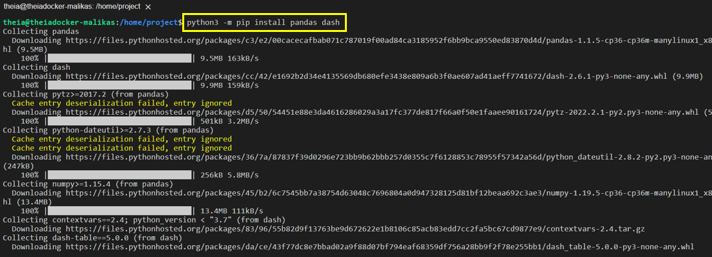
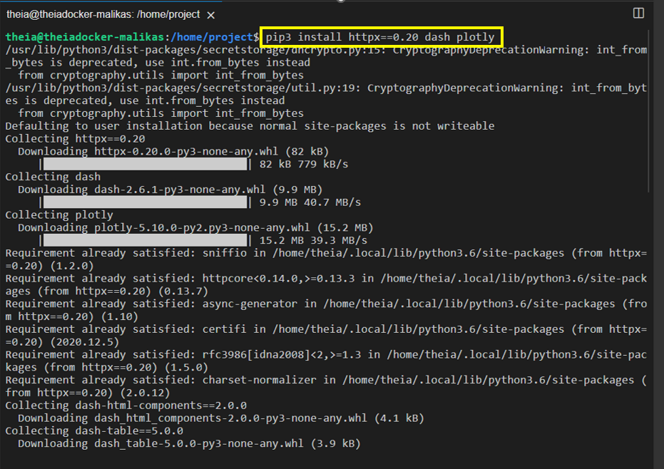
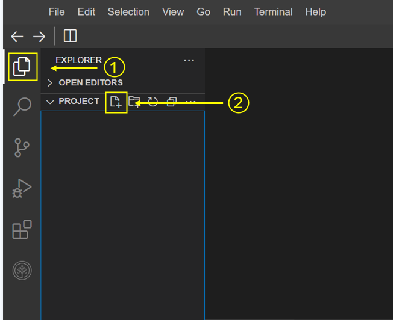
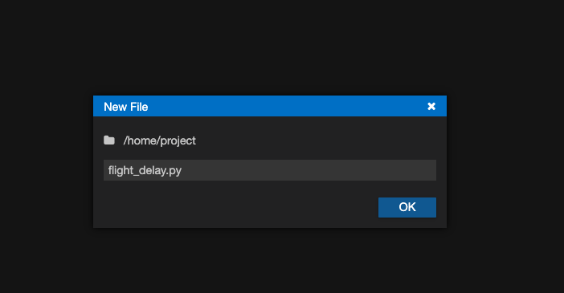
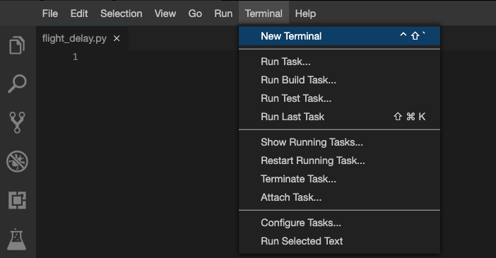
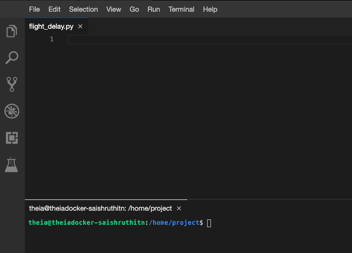
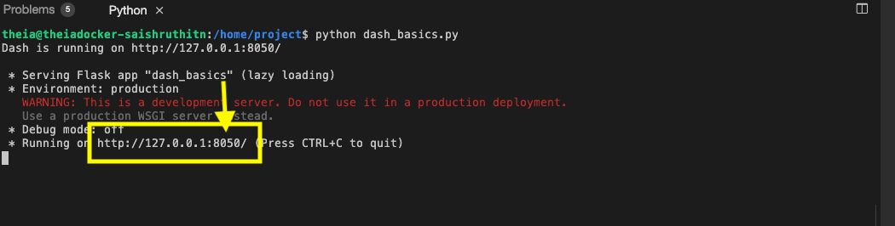
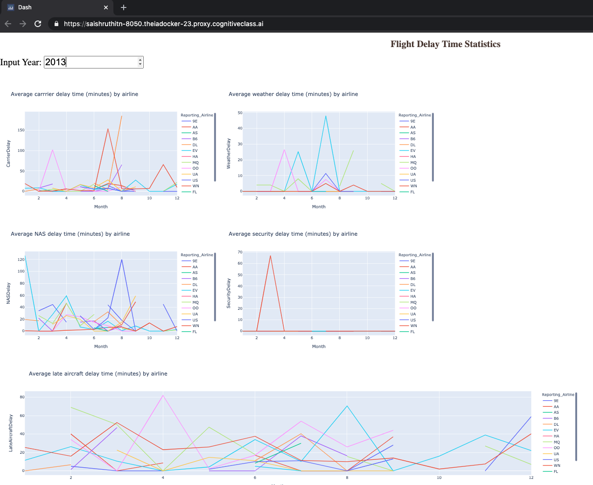

# Dash Components

### Dataset Used
[Airline Reporting Carrier On-Time Performance](https://developer.ibm.com/exchanges/data/all/airline?cm_mmc=Email_Newsletter-_-Developer_Ed%2BTech-_-WW_WW-_-SkillsNetwork-Courses-IBMDeveloperSkillsNetwork-DV0101EN-SkillsNetwork-20297740&cm_mmca1=000026UJ&cm_mmca2=10006555&cm_mmca3=M12345678&cvosrc=email.Newsletter.M12345678&cvo_campaign=000026UJ) dataset from Data Asset eXchange

## Let's start creating dash application
### Theme
Analyze flight delays in a dashboard.

Dashboard Components
- Monthly average carrier delay by reporting airline for the given year.
- Monthly average weather delay by reporting airline for the given year.
- Monthly average national air system delay by reporting airline for the given year.
- Monthly average security delay by reporting airline for the given year.
- Monthly average late aircraft delay by reporting airline for the given year.
**NOTE**: Year range should be between 2010 and 2020

### Expected Output
Below is the expected result from the lab. Our dashboard application consists of three components:

- Title of the application
- Component to enter input year
- 5 Charts conveying the different types of flight delay. Chart section is divided into three segments.
- - Carrier and Weather delay in the first segment
- - National air system and Security delay in the second segment
- - Late aircraft delay in the third segment

### To do:
- Design layout for the application.
- Create a callback function. Add callback decorator, define inputs and outputs.
- Review the helper function that performs computation on the provided inputs.
- Create 5 line graphs.
- Run the application.

## Get the tool ready
Install python packages required to run the application. Copy and paste the below command to the terminal.

    python3.8 -m pip install packaging
    python3.8 -m pip install pandas dash

    pip3 install httpx==0.20 dash plotly

- Create a new python script, by clicking on the side tool bar explorer icon and selecting new file icon, as shown in the image below.

- Provide the file name as flight_delay.py

- Open a new terminal, by clicking on the menu bar and selecting Terminal->New Terminal, as in the image below.

- Now, you have script and terminal ready to start the lab.

## TASK 1 - Read the data
Let’s start with

- Importing necessary libraries
- Reading the data

Copy the below code to the flight_delay.py script and review the code.

    # Import required libraries
    import pandas as pd
    import plotly.graph_objects as go
    import dash
    from dash import dcc
    from dash import html
    from dash.dependencies import Input, Output
    import plotly.express as px
    # Read the airline data into pandas dataframe
    airline_data =  pd.read_csv('https://cf-courses-data.s3.us.cloud-object-storage.appdomain.cloud/IBMDeveloperSkillsNetwork-DV0101EN-SkillsNetwork/Data%20Files/airline_data.csv', 
                                encoding = "ISO-8859-1",
                                dtype={'Div1Airport': str, 'Div1TailNum': str, 
                                    'Div2Airport': str, 'Div2TailNum': str})

## TASK 2 - Create dash application and get the layout skeleton
Next, we create a skeleton for our dash application. Our dashboard application layout has three components as seen before:

- Title of the application
- Component to enter input year inside a layout division
- 5 Charts conveying the different types of flight delay
Mapping to the respective Dash HTML tags:

- Title added using html.H1() tag
- Layout division added using html.Div() and input component added using dcc.Input() tag inside the layout division.
- 5 charts split into three segments. Each segment has a layout division added using html.Div() and chart added using dcc.Graph() tag inside the layout division.
Copy the below code to the flight_delay.py script and review the structure.

**NOTE**: Copy below the current code

    # Create a dash application
    app = dash.Dash(__name__)
    # Build dash app layout
    app.layout = html.Div(children=[ html.H1(),
                                    html.Div(["Input Year: ", dcc.Input()],
                                    style={'font-size': 30}),
                                    html.Br(),
                                    html.Br(), 
                                    html.Div([
                                            html.Div(),
                                            html.Div()
                                    ], style={'display': 'flex'}),
        
                                    html.Div([
                                            html.Div(),
                                            html.Div()
                                    ], style={'display': 'flex'}),
                                    
                                    html.Div(, style={'width':'65%'})
                                    ])
**NOTE**: We are using display as flex for two outer divisions to get graphs side by side in a row.

## TASK 3 - Update layout components
### Application title
- Title as Flight Delay Time Statistics, align text as center, color as #503D36, and font size as 30.
### Input component
- Update dcc.Input component id as input-year, default value as 2010, and type as number. Use style parameter and assign height of the input box to be 35px and font-size to be 30.
### Output component - Segment 1
Segment 1 is the first html.Div(). We have two inner division where first two graphs will be placed.

#### Skeleton

    html.Div([
            html.Div(),
            html.Div()
            ], style={'display': 'flex'}),

#### First inner division
- Add dcc.Graph() component.
- Update dcc.Graph component id as carrier-plot.
#### Second inner division
- Add dcc.Graph() component.
- Update dcc.Graph component id as weather-plot.
### Output component - Segment 2
Segment 2 is the second html.Div(). We have two inner division where the next two graphs will be placed.

#### Skeleton

    html.Div([
            html.Div(),
            html.Div()
            ], style={'display': 'flex'}),

#### First inner division
- Add dcc.Graph() component.
- Update dcc.Graph component id as nas-plot.
#### Second inner division
- Add dcc.Graph() component.
- Update dcc.Graph component id as security-plot.
### Output component - Segment 3
Segment 3 is the last html.Div().

#### Skeleton

    html.Div(, style={'width':'65%'})

- Add dcc.Graph() component to the first inner division.
- Update dcc.Graph component id as late-plot.
## TASK 4 - Review and add supporting function
Below is the function that gets input year and data, perform computation for creating charts and plots.

Copy the below code to the flight_delay.py script and review the structure.

**NOTE**: Copy below the current code

    """ Compute_info function description
    This function takes in airline data and selected year as an input and performs computation for creating charts and plots.
    Arguments:
        airline_data: Input airline data.
        entered_year: Input year for which computation needs to be performed.
        
    Returns:
        Computed average dataframes for carrier delay, weather delay, NAS delay, security delay, and late aircraft delay.
    """
    def compute_info(airline_data, entered_year):
        # Select data
        df =  airline_data[airline_data['Year']==int(entered_year)]
        # Compute delay averages
        avg_car = df.groupby(['Month','Reporting_Airline'])['CarrierDelay'].mean().reset_index()
        avg_weather = df.groupby(['Month','Reporting_Airline'])['WeatherDelay'].mean().reset_index()
        avg_NAS = df.groupby(['Month','Reporting_Airline'])['NASDelay'].mean().reset_index()
        avg_sec = df.groupby(['Month','Reporting_Airline'])['SecurityDelay'].mean().reset_index()
        avg_late = df.groupby(['Month','Reporting_Airline'])['LateAircraftDelay'].mean().reset_index()
        return avg_car, avg_weather, avg_NAS, avg_sec, avg_late

## TASK 5 - Add the application callback function
The core idea of this application is to get year as user input and update the dashboard in real-time. We will be using callback function for the same.

Steps:

- Define the callback decorator
- Define the callback function that uses the input provided to perform the computation
- Create graph and return it as an output
- Run the application
Copy the below code to the flight_delay.py script and review the structure.

**NOTE**: Copy below the current code

    # Callback decorator
    @app.callback( [
                Output(component_id='carrier-plot', component_property='figure'),
                ---
                --- 
                ---
                ---
                ],
                Input(....))
    # Computation to callback function and return graph
    def get_graph(entered_year):
        
        # Compute required information for creating graph from the data
        avg_car, avg_weather, avg_NAS, avg_sec, avg_late = compute_info(airline_data, entered_year)
                
        # Line plot for carrier delay
        carrier_fig = px.line(avg_car, x='Month', y='CarrierDelay', color='Reporting_Airline', title='Average carrier delay time (minutes) by airline')
        # Line plot for weather delay
        weather_fig = ------
        # Line plot for nas delay
        nas_fig = ------
        # Line plot for security delay
        sec_fig = ------
        # Line plot for late aircraft delay
        late_fig = ------
                
        return[carrier_fig, weather_fig, nas_fig, sec_fig, late_fig]
    # Run the app
    if __name__ == '__main__':
        app.run_server()

## TASK 6 - Update the callback function
### Callback decorator
- Refer examples provided here
- We have 5 output components added in a list. Update output component id parameter with the ids provided in the dcc.Graph() component and set the component property as figure. One sample has been added to the skeleton.
- Update input component id parameter with the id provided in the dcc.Input() component and component property as value.
### Callback function
Next is to update the get_graph function. We have already added a function compute_info that will perform computation on the data using the input.

Mapping the returned value from the function compute_info to graph:

- avg_car - input for carrier delay
- avg_weather - input for weather delay
- avg_NAS - input for NAS delay
- avg_sec - input for security delay
- avg_late - input for late aircraft delay
Code has been provided for plotting carrier delay. Follow the same process and use the above mapping to get plots for other 4 delays.

Refer to the full code of 4.8_Flight_Delay_Time_Statistics_Dashboard.py

    # Import required libraries
    import pandas as pd
    import dash
    from dash import dcc
    from dash import html
    from dash.dependencies import Input, Output
    import plotly.express as px
    # Read the airline data into pandas dataframe
    airline_data =  pd.read_csv('https://cf-courses-data.s3.us.cloud-object-storage.appdomain.cloud/IBMDeveloperSkillsNetwork-DV0101EN-SkillsNetwork/Data%20Files/airline_data.csv', 
                                encoding = "ISO-8859-1",
                                dtype={'Div1Airport': str, 'Div1TailNum': str, 
                                    'Div2Airport': str, 'Div2TailNum': str})
    # Create a dash application
    app = dash.Dash(__name__)
    # Build dash app layout
    app.layout = html.Div(children=[ html.H1('Flight Delay Time Statistics', 
                                    style={'textAlign': 'center', 'color': '#503D36',
                                    'font-size': 30}),
                                    html.Div(["Input Year: ", dcc.Input(id='input-year', value='2010', 
                                    type='number', style={'height':'35px', 'font-size': 30}),], 
                                    style={'font-size': 30}),
                                    html.Br(),
                                    html.Br(), 
                                    # Segment 1
                                    html.Div([
                                            html.Div(dcc.Graph(id='carrier-plot')),
                                            html.Div(dcc.Graph(id='weather-plot'))
                                    ], style={'display': 'flex'}),
                                    # Segment 2
                                    html.Div([
                                            html.Div(dcc.Graph(id='nas-plot')),
                                            html.Div(dcc.Graph(id='security-plot'))
                                    ], style={'display': 'flex'}),
                                    # Segment 3
                                    html.Div(dcc.Graph(id='late-plot'), style={'width':'65%'})
                                    ])
    """ Compute_info function description
    This function takes in airline data and selected year as an input and performs computation for creating charts and plots.
    Arguments:
        airline_data: Input airline data.
        entered_year: Input year for which computation needs to be performed.
        
    Returns:
        Computed average dataframes for carrier delay, weather delay, NAS delay, security delay, and late aircraft delay.
    """
    def compute_info(airline_data, entered_year):
        # Select data
        df =  airline_data[airline_data['Year']==int(entered_year)]
        # Compute delay averages
        avg_car = df.groupby(['Month','Reporting_Airline'])['CarrierDelay'].mean().reset_index()
        avg_weather = df.groupby(['Month','Reporting_Airline'])['WeatherDelay'].mean().reset_index()
        avg_NAS = df.groupby(['Month','Reporting_Airline'])['NASDelay'].mean().reset_index()
        avg_sec = df.groupby(['Month','Reporting_Airline'])['SecurityDelay'].mean().reset_index()
        avg_late = df.groupby(['Month','Reporting_Airline'])['LateAircraftDelay'].mean().reset_index()
        return avg_car, avg_weather, avg_NAS, avg_sec, avg_late
    """Callback Function
    Function that returns fugures using the provided input year.
    Arguments:
        entered_year: Input year provided by the user.
        
    Returns:
        List of figures computed using the provided helper function `compute_info`.
    """
    # Callback decorator
    @app.callback( [
                Output(component_id='carrier-plot', component_property='figure'),
                Output(component_id='weather-plot', component_property='figure'),
                Output(component_id='nas-plot', component_property='figure'),
                Output(component_id='security-plot', component_property='figure'),
                Output(component_id='late-plot', component_property='figure')
                ],
                Input(component_id='input-year', component_property='value'))
    # Computation to callback function and return graph
    def get_graph(entered_year):
        
        # Compute required information for creating graph from the data
        avg_car, avg_weather, avg_NAS, avg_sec, avg_late = compute_info(airline_data, entered_year)
                
        # Line plot for carrier delay
        carrier_fig = px.line(avg_car, x='Month', y='CarrierDelay', color='Reporting_Airline', title='Average carrrier delay time (minutes) by airline')
        # Line plot for weather delay
        weather_fig = px.line(avg_weather, x='Month', y='WeatherDelay', color='Reporting_Airline', title='Average weather delay time (minutes) by airline')
        # Line plot for nas delay
        nas_fig = px.line(avg_NAS, x='Month', y='NASDelay', color='Reporting_Airline', title='Average NAS delay time (minutes) by airline')
        # Line plot for security delay
        sec_fig = px.line(avg_sec, x='Month', y='SecurityDelay', color='Reporting_Airline', title='Average security delay time (minutes) by airline')
        # Line plot for late aircraft delay
        late_fig = px.line(avg_late, x='Month', y='LateAircraftDelay', color='Reporting_Airline', title='Average late aircraft delay time (minutes) by airline')
                
        return[carrier_fig, weather_fig, nas_fig, sec_fig, late_fig]
    # Run the app
    if __name__ == '__main__':
        app.run_server()

## TASK 6.2 - Run the application
- Copy and paste the below command in the terminal to run the application.

        python3.8 flight_delay.py

- Observe the port number shown in the terminal.

Click on the Launch Application option from the side menu bar. Provide the port number and click OK

The app will open in a new browser tab like below:

## Exercise : Practice Tasks
You will practice some tasks to update the dashboard.

1. Change the title to the dashboard from "Flight Delay Time Statistics" to "Flight Details Statistics Dashboard" using HTML H1 component and font-size as 35.

2. Save the above changes and rename file as flight_details.pyand relaunch the dashboard application to see the updated dashboard title.

3. Write a command to stop the running app in the terminal

